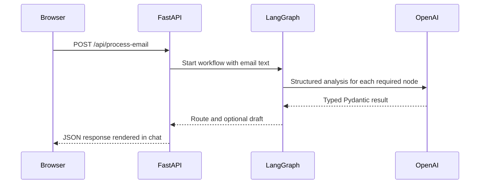

# Architecture

## Components

| Area | Responsibility |
| --- | --- |
| `backend/app/main.py` | FastAPI endpoints, CORS policy, logging, and HTTP error mapping. |
| `backend/app/config.py` | Environment-based settings from the project `.env` file. |
| `backend/app/schemas.py` | Pydantic request, response, and model-output schemas. |
| `backend/app/services/llm.py` | OpenAI/LangChain adapter with strict structured output and retry/error handling. |
| `backend/app/workflow/graph.py` | LangGraph state machine, routing policy, and draft creation. |
| `frontend/src` | TypeScript React chat UI and dark responsive styling. |

## Request lifecycle

The workflow is asynchronous. Each model call provides the original email as a human message and asks the model to conform to a Pydantic schema. The LLM service passes the value read from `.env` directly to the LangChain OpenAI client and retries transient failures twice.

## Email delivery boundary

The `draft_email` node creates a recipient, subject, and body using the route and model analysis. The API intentionally returns that draft to the browser rather than sending it. Connect an approved mail service at this boundary when external delivery is authorized.

## Security and operations

- Store `OPENAI_API_KEY` in ignored local `.env`; it is never returned by the API.
- CORS is limited to configured origins and `GET`, `POST`, and `OPTIONS` methods.
- Logs include timestamps, levels, and module names; error details are logged server-side while the API returns safe guidance.
