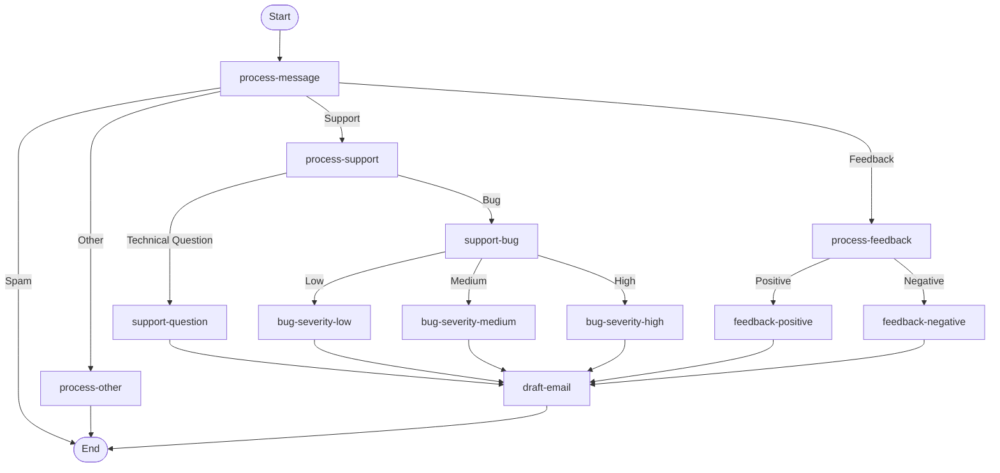

# Email Routing Workflow

The application implements this LangGraph workflow. Every route begins with `process-message`, which places the first classification in shared state.

## Outcome rules

| Route | Department |
| --- | --- |
| Positive or negative feedback | Customer Experience |
| Technical question | Technical Support |
| Low or medium bug | Support Engineering |
| High-severity bug | Incident Response |
| Spam or Other | No draft is created |

`process-other` generates a summary and reason for internal analysis, then ends without routing. Spam ends immediately. All other actionable routes arrive at `draft-email`, which creates an internal email draft for the mapped department.
